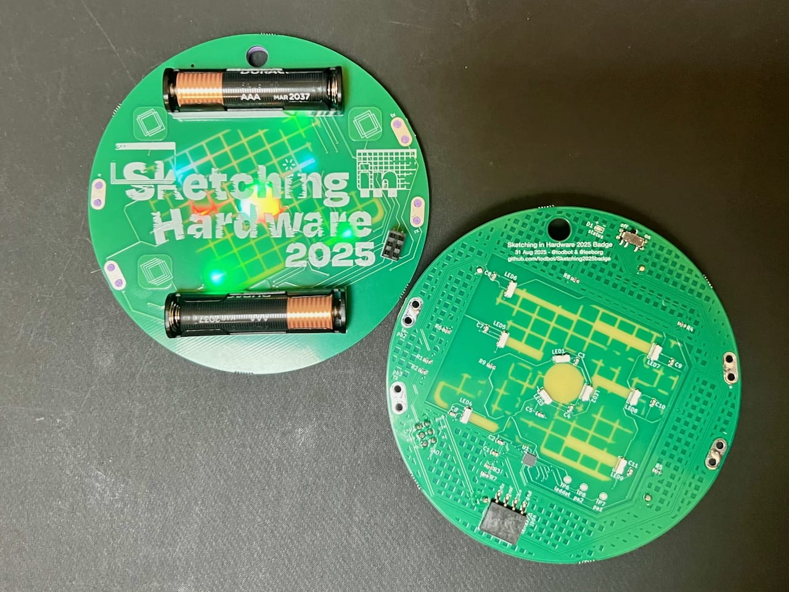
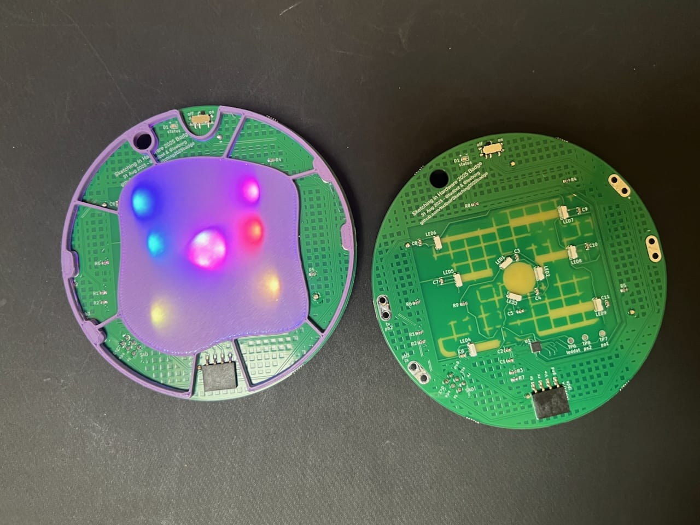
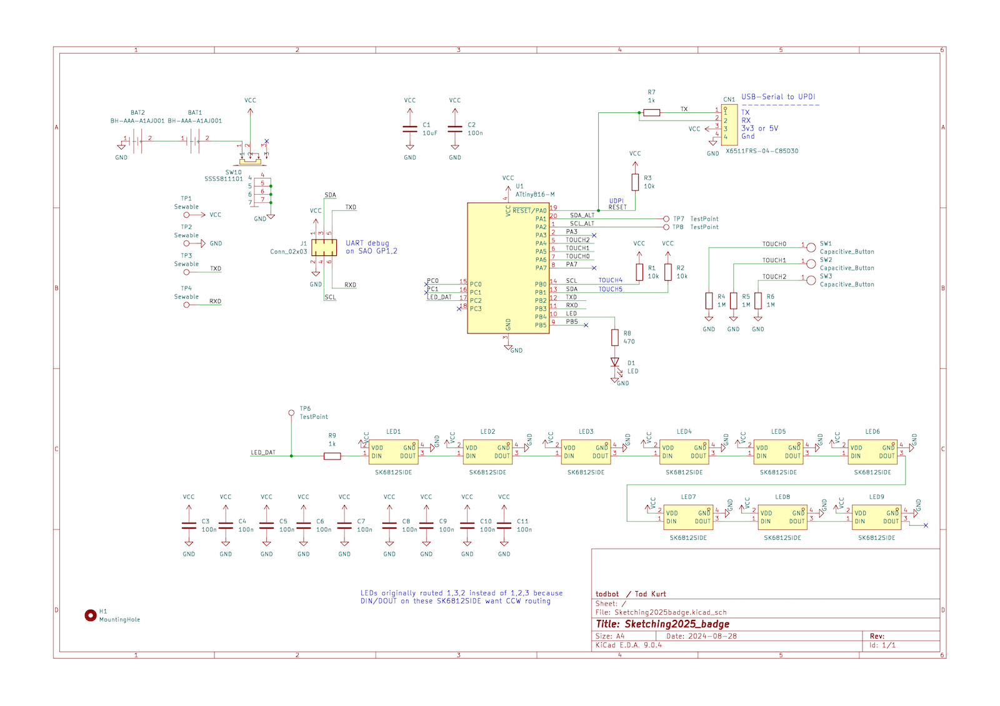

# Sketching2025badge

Badge for Sketching in Hardware 2025

# Features

- Three (3) capacitive touch pads
- Nine (9) "Neopixel"-compatible side-light RGB LEDs that shine through the back
- Four (4) sewable connectors: V+, Gnd, TX (PB2), and RX (PB3)
- One status LED on back of board
- Standard SAO pinout w/ I2C. Spare GPIO lines wired to UART TX/RX
- ATtiny816-based, same as [seesaw boards](https://learn.adafruit.com/adafruit-attiny817-seesaw)
- Easy compilation using standard Ardiuno toolchain and [megaTinyCore](https://github.com/SpenceKonde/megaTinyCore)
- Programmable with UDPI with a USB-Serial adapter
- Uses modified [TouchyTouch](https://github.com/todbot/TouchyTouch) captouch library, included

# ATtiny816 pins used

|    Use              | GPIO   | Arduino pin |
|---------------------|--------|-------------|
| Status LED          | PB4    | 5           |
| Neopixel LEDs       | PC2    | 12          |
| Touch pad 0         | PA6    | 0           |
| Touch pad 1         | PA5    | 1           |
| Touch pad 2         | PA4    | 2           |
| SAO I2C SCL         | PB0    | 9           |
| SAO I2C SDA         | PB1    | 8           |
| Sew / SAO UART TX   | PB2    | 7           |
| Sew / SAO UART RX   | PB3    | 6           |

# Protective "Backer"

Since the LEDs and MCU on the back don't have the protection of the battery
holders as standoffs, a 3d-printed "backer" is included with the badge.
It snaps onto the badge using the sewable holes and can be removed by lifting it out.
See the "enclosure" directory for STEP/STL to print your own.

# Demos

* 30Aug2025 - Prototyp0 PCBA w/ batts on face, from JLC (with oops mask hole in center)

  https://github.com/user-attachments/assets/092c7233-f480-4e2a-861c-cc95c8bd24c3

# Renders

* 16Aug2025 - Render0 - refaced TouchWheelSAO, basic graphics layout on 100mm (4") circular PCB, all components on back, routing incomplete

  https://github.com/user-attachments/assets/017a1953-9797-4b04-9c11-582e099e5368

* 16Aug2026 - Render0a - same as above, but with AAA holders on top

  https://github.com/user-attachments/assets/b0e8170d-4cca-4846-9cb0-e9c19dae7c72

# Schematic

